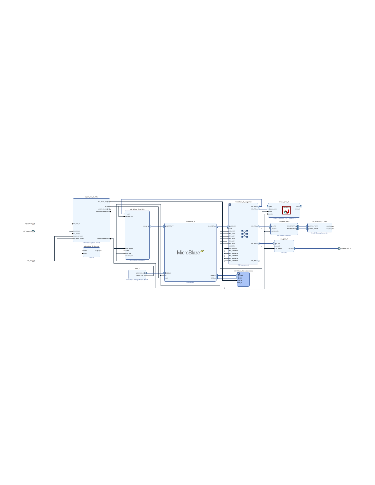

# FPGA Image Processing Accelerator

[](https://opensource.org/licenses/MIT)
[](https://www.xilinx.com/products/boards-and-kits/1-elhabt.html)
[](https://www.xilinx.com/products/design-tools/vitis.html)

Hardware accelerator for real-time image processing on Xilinx Zynq-7020 FPGA using bare-metal MicroBlaze control.

---

## Table of Contents

- [Overview](#overview)
- [Features](#features)
- [SoC Architecture](#soc-architecture)
- [Project Structure](#project-structure)
- [Getting Started](#getting-started)
- [Build Instructions](#build-instructions)
- [Performance](#performance)
- [Technical Details](#technical-details)

---

## Overview

This project implements a **hardware-accelerated image processing pipeline** on an FPGA. The design uses:

- **Vitis HLS** for high-level synthesis of image processing algorithms
- **MicroBlaze** soft processor for control (no Linux required)
- **AXI4-Stream** interface for efficient pixel streaming
- **AXI-Lite** for register-based control

**Key Highlights:**
- Real-time processing at **325+ FPS** (640x480)
- 7 selectable filter modes via software
- Fully synthesizable and deployable bitstream included

---

## Features

| Filter | Mode | Description |
|--------|:----:|-------------|
| Bypass | 0 | Pass-through (no processing) |
| Grayscale | 1 | RGB to grayscale conversion |
| **Sobel** | 2 | Edge detection (3x3 convolution) |
| Threshold | 3 | Binary thresholding |
| Gaussian | 4 | 3x3 Gaussian blur |
| Negative | 5 | Image inversion (255 - pixel) |
| Sharpen | 6 | Image sharpening |

---

## SoC Architecture

The complete System-on-Chip block design integrating MicroBlaze, Image Processing IP, and memory subsystem:



---

## Project Structure

```
image_pros/
├── src/                             # HLS Source Code
│   ├── image_processing.h           # Header with types and constants
│   ├── image_processing.cpp         # Main HLS implementation
│   └── testbench.cpp                # C simulation testbench
│
├── sw/                              # Standalone Software
│   └── main.c                       # MicroBlaze bare-metal app
│
├── image_process_sw/                # Vitis Application Project
│   └── src/main.c                   # Application source
│
├── image_process_platform/          # Vitis Platform
│   ├── hw/                          # Hardware files (XSA, bitstream)
│   │   ├── image_process.xsa
│   │   ├── image_process.bit
│   │   └── drivers/
│   └── platform.tcl
│
├── image_proscess/                  # Vivado Project
│   ├── image_proscess.xpr
│   └── image_proscess.srcs/
│
├── solution1/                       # HLS Solution
│   ├── syn/report/
│   └── impl/ip/
│
├── docs/                            # Documentation
│   └── images/
│
├── constraints.xdc                  # FPGA pin constraints
├── run_hls.tcl                      # Vitis HLS build script
├── vivado_block_design.tcl          # Vivado automation script
└── output.bit                       # Final bitstream
```

---

## Getting Started

### Prerequisites

- **Xilinx Vitis HLS** 2022.2 or later
- **Xilinx Vivado** 2022.2 or later
- **Xilinx Vitis IDE** for software development
- Target board: **Zynq-7020** (e.g., PYNQ-Z2, ZedBoard)

### Quick Start

```bash
# Clone the repository
git clone https://github.com/RISABH-UG26/image_pros.git
cd image_pros

# Run HLS synthesis
vitis_hls -f run_hls.tcl

# Open Vivado and source the block design
vivado -source vivado_block_design.tcl
```

---

## Build Instructions

### Step 1: HLS Synthesis

```bash
vitis_hls -f run_hls.tcl
```

This runs:
1. C Simulation
2. C Synthesis to RTL
3. Co-simulation
4. IP Export

### Step 2: Vivado Block Design

```tcl
# In Vivado Tcl Console
source vivado_block_design.tcl
```

Then run: **Synthesis → Implementation → Generate Bitstream**

### Step 3: Software Application

1. Open **Vitis IDE**
2. Import platform from `image_process_platform/`
3. Create application from `image_process_sw/`
4. Build and deploy to hardware

---

## Performance

### Resource Utilization

| Resource | Usage | Available | Utilization |
|----------|------:|----------:|:-----------:|
| LUT      | ~2,500 | 53,200   | 4.7% |
| FF       | ~1,800 | 106,400  | 1.7% |
| BRAM     | 4      | 140      | 2.9% |
| DSP      | 6      | 220      | 2.7% |

### Timing Performance

| Metric | Value |
|--------|------:|
| Clock Frequency | 100 MHz |
| Throughput | 1 pixel/cycle |
| Latency | ~3 line delays |
| Max Frame Rate | **325 FPS** @ 640x480 |

---

## Technical Details

### AXI4-Stream Interface

| Signal | Direction | Width | Description |
|--------|:---------:|:-----:|-------------|
| TDATA  | In/Out | 8-bit | Pixel data |
| TVALID | In/Out | 1-bit | Data valid |
| TREADY | In/Out | 1-bit | Ready to receive |
| TLAST  | In/Out | 1-bit | End of line |
| TUSER  | In     | 1-bit | Start of frame |

### Sobel Edge Detection

**Horizontal Kernel (Gx):**
```
|-1  0  1|
|-2  0  2|
|-1  0  1|
```

**Vertical Kernel (Gy):**
```
|-1 -2 -1|
| 0  0  0|
| 1  2  1|
```

**Output:** `Gradient = |Gx| + |Gy|` (saturated to 0-255)

### Line Buffer Implementation

For 3x3 convolution on a 640-pixel wide image:
- 2 line buffers x 640 pixels = **1,280 bytes**
- Enables accessing 3x3 pixel neighborhood in a single cycle

---

## Educational Notes

### Why FPGA over CPU?

FPGAs enable **parallel processing** - all pixels in the pipeline are processed simultaneously, achieving >100x speedup over sequential CPU processing.

### Why AXI4-Stream?

- No address overhead for streaming data
- Built-in handshaking (TVALID/TREADY) prevents data loss
- TLAST marks row boundaries for synchronization
- Industry standard for video IP cores

### What is Initiation Interval (II)?

With **II=1**, we accept a new pixel every clock cycle, achieving maximum throughput of 100M pixels/second at 100 MHz.

---

## License

This project is licensed under the MIT License.

---

## Acknowledgments

- Xilinx for Vitis HLS and Vivado tools
- Course instructors for guidance on FPGA design
